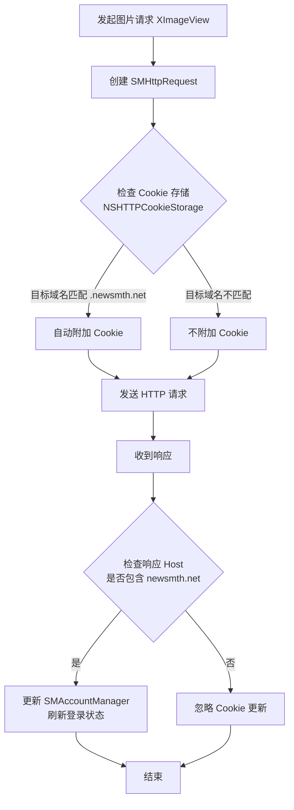

# Cookie 管理与图片请求分析

## 1. 概述

本项目主要通过 `SMAccountManager` 单例结合系统级的 `NSHTTPCookieStorage` 来管理用户 Cookie。网络请求主要由 `SMHttpRequest` (基于 ASIHTTPRequest) 和 `SMNetwork` (基于 Alamofire) 处理。

## 2. 核心组件分析

### 2.1 Cookie 管理 (`SMAccountManager`)
- **位置**: `newsmth/SMAccountManager.m`
- **职责**: 负责加载、保存和刷新用户的登录状态 Cookie（主要是 `main[UTMPUSERID]`）。
- **机制**: 
  - 初始化时从 `NSHTTPCookieStorage` 加载 `//m.newsmth.net` 域下的 Cookie。
  - 同时会从 `NSUserDefaults` 读取持久化的 Cookie 并同步回 `NSHTTPCookieStorage`。

### 2.2 网络请求 (`SMHttpRequest`)
- **位置**: `newsmth/SMHttpRequest.m`
- **Cookie 发送**: 
  - 在 `setup` 方法中，手动强制注入 Cookie 的代码已被注释：
    ```objective-c
    // self.requestCookies = [[SMAccountManager instance].cookies mutableCopy];
    ```
  - 因此，请求依赖于底层的 `ASIHTTPRequest` 自动处理 Cookie。`ASIHTTPRequest` 默认使用 `NSHTTPCookieStorage`。
- **Cookie 接收**:
  - 在 `request:didReceiveResponseHeaders:` 中，只有当主机名包含 `newsmth.net` 时，才会更新 `SMAccountManager` 中的 Cookie：
    ```objective-c
    if ([request_.url.host containsString:@"newsmth.net"]) {
        [[SMAccountManager instance] setCookies:request_.responseCookies];
    }
    ```

### 2.3 图片加载 (`XImageView`)
- **位置**: `newsmth/Common/XImageView.m`
- **实现**: 使用 `SMHttpRequest` 发起下载请求。
- **Cookie 行为**: 由于 `SMHttpRequest` 依赖 `NSHTTPCookieStorage`，图片请求遵循标准的 HTTP Cookie 作用域规则。

## 3. 结论：非本站域名是否发送 Cookie？

**答案：不会。**

如果访问图片的 URL 不是 `.newsmth.net` (例如第三方图床)，系统行为如下：
1. `SMHttpRequest` 发起请求。
2. 底层网络库查询 `NSHTTPCookieStorage`。
3. `NSHTTPCookieStorage` 根据 Cookie 的 `Domain` 属性进行匹配。
4. `newsmth.net` 的 Cookie（如 `main[UTMPUSERID]`）域不匹配第三方域名。
5. **请求头中不会包含 newsmth 的 Cookie。**

## 4. 流程图



